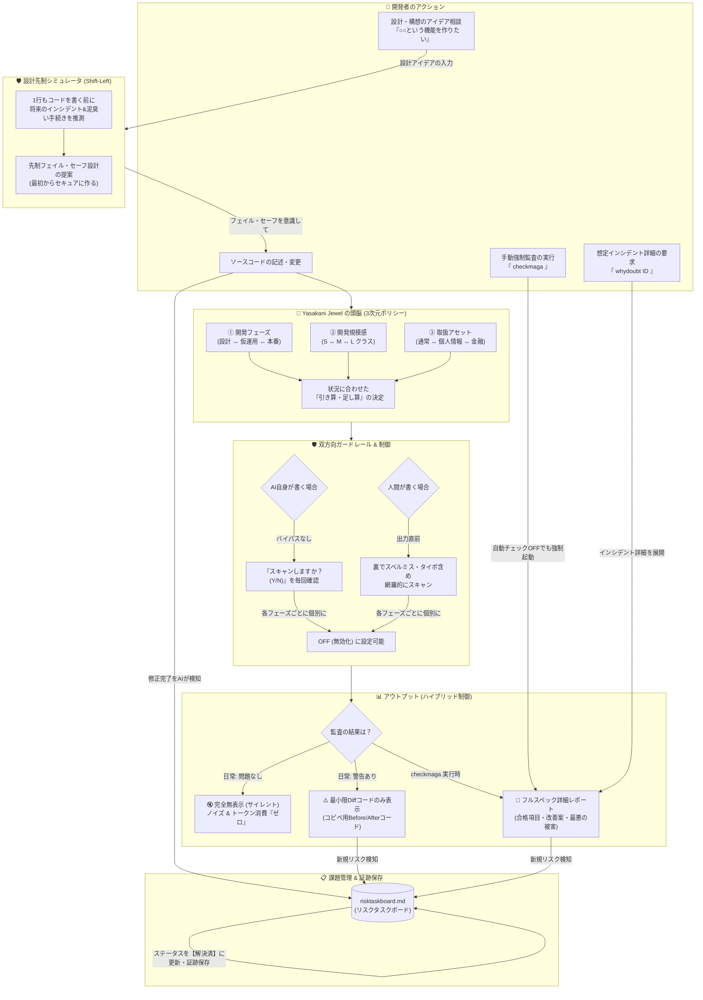

# 🔮 Yasakani Jewel (八尺瓊の宝玉) - 究極の取扱説明書（User Manual）

本取扱説明書は、個人開発者のPCや開発スピードに負荷をかけない「常駐プロセス・ゼロ」かつ「設計先制型」の自律セキュリティ監査ツール **Yasakani Jewel** を、あなたが120%使いこなすための公式マニュアルです。

> [!TIP]
> この取扱説明書は、プロジェクトの一番上の階層、またはドキュメント管理フォルダに保管し、いつでも参照できるように手元に置いておいてください。

> [!NOTE]
> **本書はマニュアル本体です。** 目的別の文書案内（仕様書 / 防衛能力 / ADR / 第三者検証ルール）はプロジェクトの [README.md](README.md) §📚 にまとまっています。「何を防げるか」「アーキ判断の経緯」「変更履歴」を素早く知りたい場合は、まず README の目的別テーブルを参照してください。

---

## 🗺️ 1. Yasakani Jewel の全体ビジョン（概要フロー）

Yasakani Jewel は、ただコードを検査するだけの静的解析ツールではありません。
「1行もコードを書く前のアイデア段階」からあなたに伴走し、リスクを先制防御する**双方向型ガードレール・システム**です。



---

## 🛠️ 2. インストール

Yasakani Jewel は npm パッケージとして配布されます。プロジェクトのルートディレクトリで、以下の **1 コマンド**を実行するだけで導入が完了します（手で配置・コピーするファイルはありません）。

```sh
npx yasakani-jewel init
```

`init` が自動で配置・配線するもの:

```text
[あなたのプロジェクトルート]
 ├── .yasakani/
 │    ├── yasakani-jewel.md   <-- AI 指示書（Claude の脳）
 │    ├── .yasakanirc         <-- 3次元ポリシー設定 (JSON)
 │    ├── prompt-policy.json  <-- AI prompt Markdown の公開/非公開分類
 │    └── scan.js             <-- プリフィルター・スキャナ
 ├── CLAUDE.md / GEMINI.md / AGENTS.md / .cursorrules /
 │   .github/copilot-instructions.md   <-- 各 AI 設定へポインタを「追記」（既存内容は保持）
 ├── .git/hooks/pre-commit    <-- git フック（git リポジトリの場合のみ）
 └── .vscode/settings.json    <-- 保存時スキャン設定（VS Code / Cursor）
```

> [!NOTE]
> 必要環境は **Node.js 16 以上**のみ（`npx` は Node に同梱）。`.bat` や PowerShell は不要で、Windows / Mac / Linux 共通で動作します。配線を除去したい場合は `npx yasakani-jewel uninstall` を実行してください。

---

## 🏃 3. 日常の操作手順（基本ワークフロー）

### 3.1 多層自動トリガー（環境に応じて自動配線）

Yasakani Jewel は「保存の瞬間」だけに頼らず、**4つの層**で監査をかけます。
プロジェクトルートで `npx yasakani-jewel init` を一度実行するだけで、
あなたの環境で使える層が **自動で配線** されます（追加の手動インストール不要）。

| 層 | トリガー | 必要なもの |
|---|---|---|
| **A. AIチャット連携** | AI（Claude/Cursor/Copilot）がコードを生成・変更する瞬間 | なし（指示書ポインタを各 AI 設定へ自動追記） |
| **B. git pre-commit** | `git commit` 実行時 | git リポジトリ（フックを自動設置） |
| **C. 保存時スキャン** | エディタでファイル保存（Ctrl+S） | VS Code / Cursor（Run on Save 拡張を自動インストール） |
| **D. 手動** | `checkmaga` 入力 / `npx yasakani-jewel scan` 実行 | なし（いつでも使える） |

* **git 連携プロジェクト** → A+B+C+D すべて。
* **git 非連携プロジェクト** → A+C+D（B のみ非対応）。
* **VS Code/Cursor 以外のエディタ** → A+D（+ git なら B）。

> [!NOTE]
> 「保存の瞬間」に処理を走らせるには、OS／エディタ仕様上どうしても
> 「保存イベントを監視する誰か」が必要です。Yasakani Jewel は常駐デーモンを
> 一切持たない方針のため、その役を Run on Save 拡張（層C）または git フック
> （層B）に委ねています。どちらも `npx yasakani-jewel init` が自動で配線します。

> [!TIP]
> 層B（コミット時）でリスクが見つかると、秘密情報が履歴に入る前に
> **コミットを中断**します。確認のうえ進める場合は `git commit --no-verify`。

---

### 3.2 【手動】手動でローカルチェックを行う場合
コミット前や、任意のタイミングで手動でチェックしたい場合は、ターミナルで以下を叩くだけです。

```sh
npx yasakani-jewel scan
```

特定ファイルだけを確認したい場合は、パスを指定できます。git リポジトリ内でも、明示指定されたファイルを直接スキャンします。

```sh
npx yasakani-jewel scan path/to/file.md
```

> [!NOTE]
> **「何も警告が出ない（正常）」が最強の状態です。**
> プレフィルターは0.001秒で検証を終え、安全であることを確認して沈黙します。PCの動作を重くすることは一切ありません。
> ハードコード秘密情報に加え、メールアドレス・日本の電話番号・郵便番号・住所らしき文字列・`氏名` / `名前` / `address` / `email` / `phone` 等のラベル付き個人情報も検知し、Git への混入をコミット前に止めます。
> Markdown (`.md` / `.mdx`) では、通常の長文による高エントロピー誤検知を抑えつつ、`System Prompt`、`Tool Definitions`、`network_configuration`、`filesystem_configuration`、`Ignore previous instructions`、`{antml:...}` などの AI 指示書・プロンプト断片を検知します。
> AI prompt Markdown は `.yasakani/prompt-policy.json` で扱いを分類します。既定では `prompts/public/**` は通知のみ、`prompts/private/**` と `private/**/system-prompt.md` は commit 禁止、`*.system-prompt.md` は強警告、未分類の prompt 断片は配置方針を確認するために停止します。git hook / CI 内で入力待ちは行いません。

---

## 💬 4. AIチャットでの特殊コマンド一覧（ハイブリッドコマンド）

AIチャット（Claude / Cursor / Copilotなど）の対話画面で以下のコマンドを入力することで、Yasakani Jewel の監査機能が直接起動します。

> [!IMPORTANT]
> **【Claude Code (CLI) をお使いの皆様へ】**
> Claude Codeの対話画面（CLI）において `/checkmaga` などのスラッシュ付きコマンドを入力すると、**Claude Code CLI 自体のビルトインシステムコマンドとしてパースされ、エラーになってしまいAI（Yasakani Jewel）まで届きません。**
> そのため、**「スラッシュをつけないプレーンテキスト（例：`checkmaga`）」**で入力してください。Yasakani Jewel は、スラッシュなしのテキストでも完全に同じようにコマンドを検知する「ハイブリッド仕様」に最適化されています。

> [!TIP]
> **💡 コマンド入力時のコツ（ファイル名部分一致による誤認防止）**
> プロジェクトルートに `checkmaga-search.csv` などの `checkmaga` というキーワードが含まれるファイルが存在する場合、Claude Code CLI で単に `checkmaga` と打つと、CLI側のシステムが「そのファイルを操作（中身の読み書きなど）したいのだろう」と勘違いし、空ファイル読み込みエラー等のバグを引き起こすことがあります。
> これを完全に回避するために、以下のいずれかの方法で入力することを強く推奨します。
> * **平仮名で入力する**: `ちぇくまが`
> * **プレフィックスを付与する**: `yasakani checkmaga`
> 
> Yasakani Jewel のAI頭脳は、これら平仮名表記やプレフィックス付きの呼び出しに対しても、完全に同一の「手動強制監査コマンド」として最優先で自律解釈するよう徹底教育されています。

### 🔮 ① 全体強制監査・設計先制相談: `checkmaga` (または `/checkmaga` / `ちぇくまが` / `yasakani checkmaga`)
最もよく使う中核コマンドです。開発の進行状況（フェーズ）によって、自動的に挙動が最適化されます。

* **【まだコードを書いていない「設計・モック段階」】**
  * **相談方法**: `checkmaga 〇〇という機能（例：Stripe決済連携）を作りたい` と入力。
  * **AIの挙動**: 「設計先制シミュレータ」が起動。将来発生し得る最悪のセキュリティインシデント（例：決済API爆死による高額請求など）を予測し、最初から安全に作るための**「最小限のセキュアひな形Before/Afterコード」**をその場に提示します。
* **【すでにコードを実装している段階】**
  * **スキャン方法**: `checkmaga` とだけ入力。
  * **AIの挙動**: 日常のサイレントモードを例外的に解除し、出典ガイドの **MECE 構造（3レイヤー × 2状態 = 6領域）＋ 10 項目の Gap Defenses** を網羅した詳細レポートを生成します。
  * **【ローカル監査証跡として保存】** レポートは Markdown ファイル `checkmaga-reports/YYYYMMDDTHHMMSS-checkmaga.md` として**必ず保存**されます。検出されたリスクだけでなく、検査した全項目（問題なし項目も `✅ 検査済`、対象外も `N/A — 理由`）が列挙され、「ここまで何を確認したか」が後から辿れます。**git 管理対象外がデフォルト**（`.gitignore` 済）— ローカル保管のみで、リモートには push されません。
  * **【低信頼 Finding】** 確定根拠が弱い項目は捨てず、コミットブロックや PR コメントではなく、レポートの「調査候補（低信頼・非ブロック）」に隔離して残します。
  * **【重複して見える記載】** 同じリスクが複数セクションに出る場合があります。これは MECE 6 領域 / Gap Defenses / 対象ファイル / 未解決リスク / 修正Diff の各観点で確認証跡を残すためであり、レポート末尾にその出力方針を明記します。
  * **【スコープ宣言】** レポート最終セクションに **OSI 参照モデル別カバレッジ** が付き、本ツールでカバーできない領域（L1〜L4 / 物理 / 人的 / 運用 / AI 自身の堅牢性 等）を率直に開示します。「何を見ていないか」が利用者にとっても明確になります。
  * **チャット側の出力**: 生成されたレポートファイルへのリンクと、検出された未解決リスクの Before/After Diff のみ。長文の重複は出力されません。

---

### 🔍 ② リスク因果の追及: `whydoubt [リスクID]` (または `/whydoubt [リスクID]`)
日常の警告時に表示されるリスクID（例: `RTB-001`）について、その背景を深く知るためのコマンドです。

* **入力例**: `whydoubt RTB-001`
* **AIの挙動**:
  日常の画面ノイズを極小化するために普段は隠されている、**「最悪のインシデントシナリオ」**と、それに伴う**「泥臭い復旧手続き（各種サポートとの英語での交渉、全トークンの無効化ロール手順等）」**を赤裸々にシミュレーションして解説します。

---

### 🚨 ③ インシデント緊急対応: `incident` (または `/incident`)
万が一、APIキーが流出したり、不審な通信（ハッキング）を発見したなどのトラブル時に使用します。

* **入力例**: `incident`
* **AIの挙動**:
  経産省「サイバー攻撃被害に係る情報の共有・公表等に関するガイダンス」に準拠した**「2分類モデル」の報告用日本語ドラフト**を即座に自動生成します。
  1. **① 攻撃情報の「共有」ドラフト**: 個人情報を含まず、速やかにIPAやJPCERT/CCに報告するためのテクニカルデータ。
  2. **② 被害内容の「公表」ドラフト**: ユーザー保護・お詫び・公式リリース用のメールテンプレート。
  3. **③ 物理的初動チェックリスト**: パニック状態を抑え、数分以内に実行すべき「APIキー即時ロール、サーバープロセス遮断」などの応急処置手順。

---

## 📋 5. リスクタスクボード (`risktaskboard.md`) の見方

リスクが検出されると、プロジェクトルートに `risktaskboard.md` が作成されます。これは単なるバグ管理表ではなく、**「あなたの安全な開発を証明する監査証跡（歴史）」**です。

### 🎮 ゲーム感覚で解決していくルール
* **[未解決] のタスク**:
  AIから提示された `Before/After Diff` コードをコピーして、あなたのソースコードを修正してください。
* **[解決済] への移動**:
  コードを修正すると、AIはそれを自動で検知し、タスクを削除するのではなく **「解決日時」と「解決方法」を追記して [解決済] の履歴に自動移動**させます。
* **メリット**:
  開発が進むほど、安全を証明する客観的なログ（監査証跡）が蓄積され、ゲームのクエストをクリアしたような達成感を得られます。

---

## 🔐 6. 第三者検証・フレンド環境での共有ルール

フレンドや外部協力者のプロジェクトで Yasakani Jewel を検証する場合は、**検証対象プロジェクトの持ち主のPCでローカル実行**してください。Yasakani Jewel は初期版では外部 API や PR コメントを使わない設計ですが、レポートやスクショを人間が共有すると、そこから機密が漏れる可能性があります。

### 共有してはいけないもの

- `checkmaga-reports/*.md` の生ファイル
- `risktaskboard.md` の生ファイル
- ターミナル出力やエディタ画面のスクショ
- AIチャット履歴
- ソースコード、git diff、パッチ、コミットURL
- `.env`、秘密鍵、APIキー、設定ファイル、エラーログ
- 実ユーザー名、顧客名、取引先名、メールアドレス、電話番号、住所
- 実ドメイン、IPアドレス、クラウドアカウントID、バケット名、DB名、ローカルパス、ブランチ名、コミットID

### 共有してよいもの

- 検出件数（例: `FAIL 2 / WARN 5 / 調査候補 3`）
- 誤検知っぽいカテゴリ（例: `PII`, `CI/CD`, `Dockerfile`）
- レポートで読みにくかったセクション名
- どの説明が分かりづらかったか
- 実値を伏せた redacted 版の最小抜粋

### redacted 版を作るときのルール

- 値は `[secret]`, `[email]`, `[phone]`, `[customer]`, `[domain]`, `[ip]`, `[path]`, `[account-id]` のように置換する。
- コード全体ではなく、相談に必要な数行だけに絞る。
- 伏せた後でもプロジェクトや顧客を推測できる情報が残っていないか確認する。
- 判断に迷う場合は、共有せず「カテゴリ・件数・困った点」だけを伝える。

---

## ❓ 7. よくある質問 (FAQ)

#### Q1. 日常にチェックを一時的にバイパス（ON / OFF）したい場合は？
設定ファイル `.yasakani/.yasakanirc` の `"bypass_permission"` 内の各フェーズ（`design`, `staging`, `production`）を `true` に書き換えることで、個別にバイパスできます。
> [!WARNING]
> セキュリティの死角を防ぐため、すべてのフェーズを一括で `true`（全面バイパス）にすることはできません。必ず個別に設定してください。

#### Q2. バイパスがONのときにAIに警告されます。消せますか？
自動確認の戻し忘れ（ゾンビ化）を防ぐため、バイパスがONの間は、AIの回答の末尾に「⚠️注意: バイパスがONになっています」という小さなサイレント警告が自動付与されます。設定を `false` に戻すことでこの警告は消えます。

#### Q3. 日常で警告が出たとき、どうやって修正すればいい？
AIは長文の解説を省き、コピペでそのまま置換できる **Before/After Diffコード** をピンポイントで提示します。
```diff
- 脆弱なコード（Before）
+ 安全なコード（After）
```
この「After」のコードをそのまま対象ファイルにコピー＆ペーストするだけで、セキュリティ修正は一瞬で完了します。

---

🔮 **Yasakani Jewel は、あなたの開発スピードを邪魔することなく、見えない盾となって資産とコードを守り続けます。**
何か困ったことや、インシデントの不安がある時は、いつでもチャットで `checkmaga` と話しかけてください！
